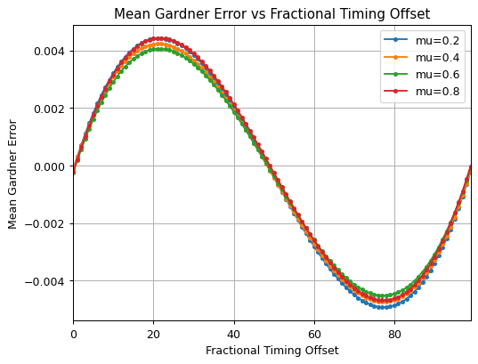
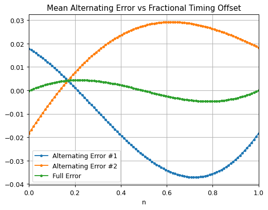

# Debug Log: Symbol Timing Recovery Issue

## Problem Overview

While developing a Gardner-based timing error detector (TED), I noticed that my symbol timing offset was consistently converging to around 0.5 symbols, regardless of the true offset.

This suggested that the timing loop was locking to an incorrect fractional offset and that the TED output was not guiding the loop correctly toward zero error.

---

## Step-by-Step Investigation

### 1. Observing the Symptom

- The loop would consistently settle near 0.5-symbol offset.
- Even when the true offset was 0.2, 0.7, etc., the estimated timing hovered around 0.5.

### 2. Plotting Average TED Output vs True Offset

- I plotted the average TED output across a sweep of fixed fractional offsets (e.g., 0.0 to 1.0).
- The plot resembled a sine wave with roots at 0, 0.5, and 1.0.

   
*TED output vs timing offset over full sampling window*

---

### 3. Inspecting TED Output Over Time

- I logged the raw TED output values over time and visualized the corresponding sample points. The plots showed that the TED output was alternating between positive and negative values every sample.  

---

### 4. Plotting Every-Other-Sample TED Output

- I then recalculated average TED output, but only using every other sample (i.e., once per symbol) .
- This revealed two out-of-phase sine waves that canceled out at offset = 0.5.

   
*TED output vs offset using every other sample — clear separation of two components*

---

## Solution

- I modified the TED logic to only update the timing control loop on every other sample, matching the symbol clock.
- This aligned the update timing with the sample used for interpolation, allowing correct timing error accumulation.

---

## Conclusion

After this fix, the timing error loop converged correctly to near-zero offset, and symbol alignment improved significantly.

This debugging process highlighted:
- The importance of update timing in Gardner TED
- The value of plotting and isolating internal behavior before guessing at fixes

---

## Related Files

- `src/dsp/timing_recovery.cpp` — Updated control logic
- `images/` — Plots used in this document

